# Google OAuth Setup for n8n (Gmail · Drive · Sheets · Calendar)

> This guide walks you through creating Google OAuth credentials, adding test users, enabling required APIs, and connecting the credential in **n8n**. It includes screenshots for each step.

## Prerequisites
- A Google account with access to Google Cloud Console.
- Your n8n base URL:
  - Local: `http://localhost:5678`
  - Public/Cloud: e.g., `https://YOUR-DOMAIN/rest/oauth2-credential/callback`
- You’ll need the exact **Redirect URI** from n8n later.

---

## 1) Copy the Redirect URI from n8n
Open any Google credential in n8n (e.g., Google Sheets) and copy the **OAuth Redirect URL**. You will paste this into Google Cloud's **Authorized redirect URIs**.

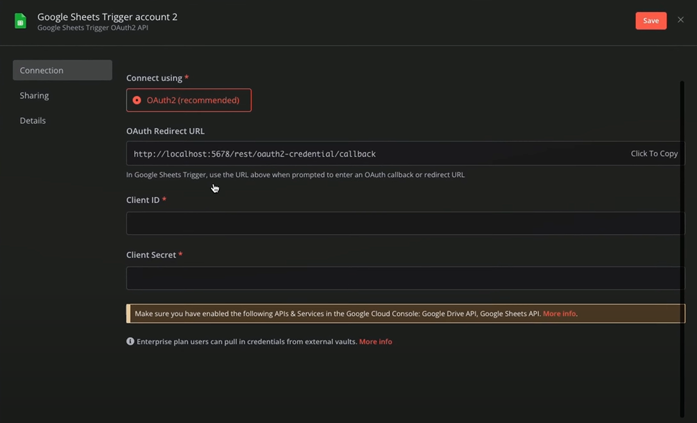

---

## 2) Open Google Cloud Console and select/create a project
Go to **console.cloud.google.com** → pick an existing project or create a new one.

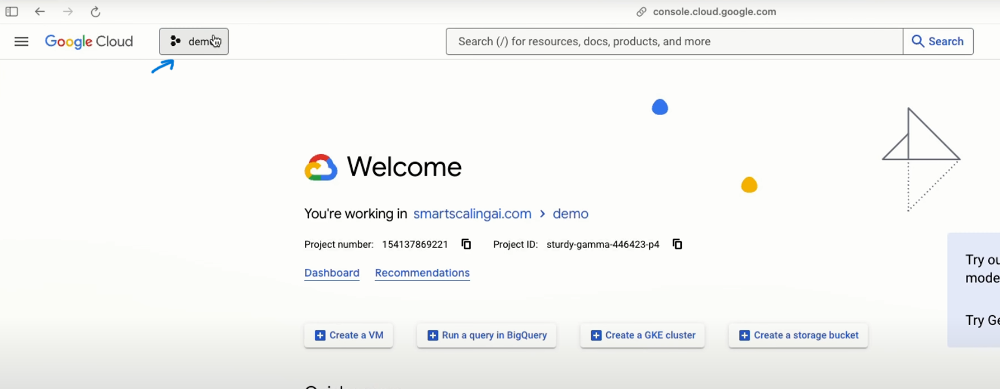

Create a new project if you don’t want to reuse an existing one:

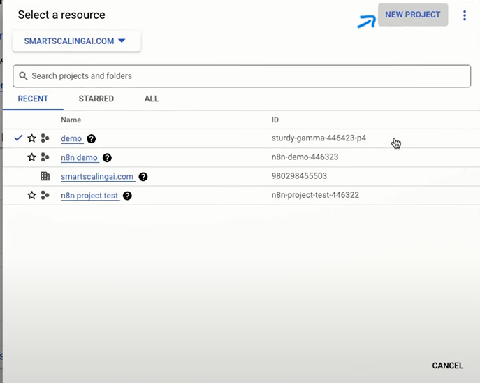

---

## 3) Configure the OAuth consent screen
From the left menu, navigate to **APIs & Services → OAuth consent screen**.

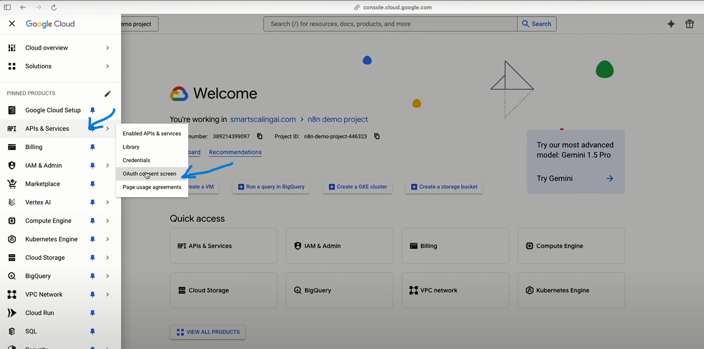

Choose **External** and click **Create** (recommended unless you are strictly internal-only to your Workspace).

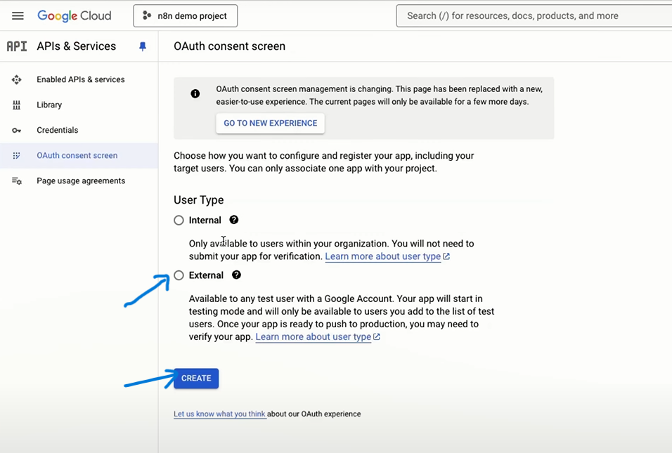

Fill the basic info (App name, support email). You can leave logo blank for testing.

---

## 4) Add Test Users
While your app is in **Testing**, only **Test users** can authenticate. Add the Google accounts you’ll log in with.

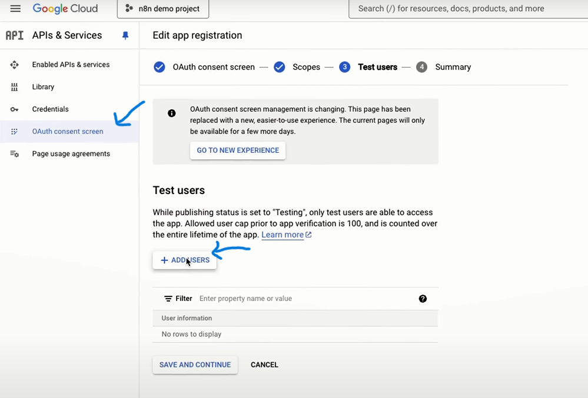

Enter emails and click **Add** → **Save and Continue**.

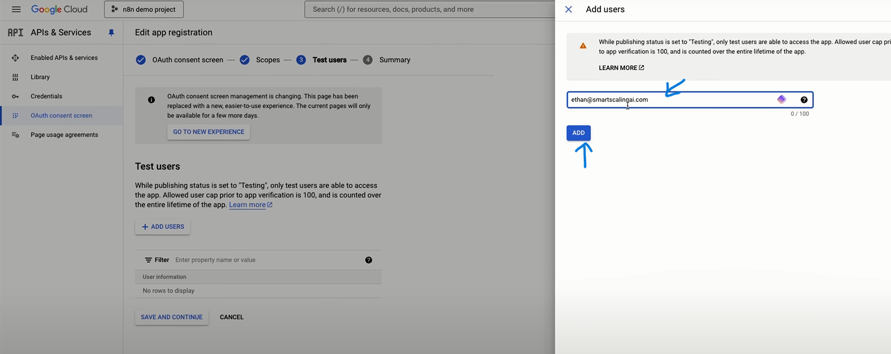

---

## 5) Create OAuth Client ID (Web application)
Go to **APIs & Services → Credentials → Create credentials → OAuth client ID**.

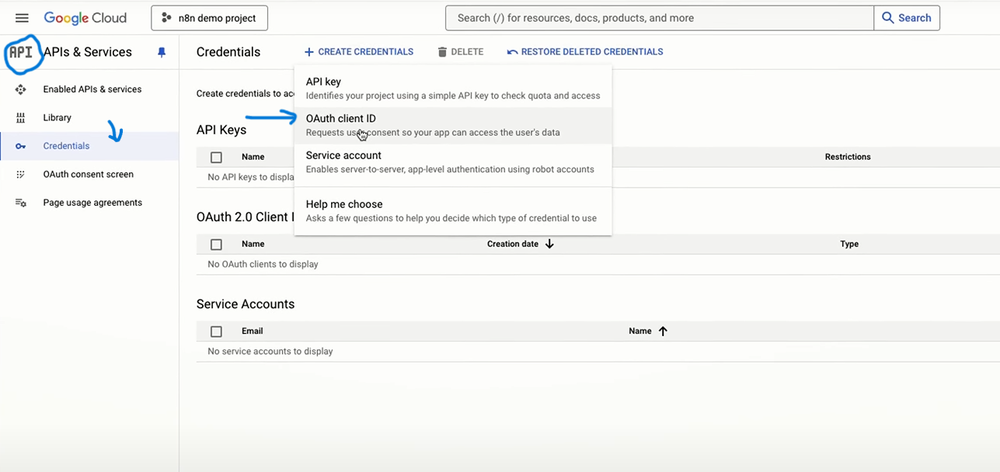

Paste the **Redirect URI** you copied from n8n in Step 1. Use your actual n8n base URL:

- Local example: `http://localhost:5678/rest/oauth2-credential/callback`
- Public/Cloud example: `https://YOUR-DOMAIN/rest/oauth2-credential/callback`

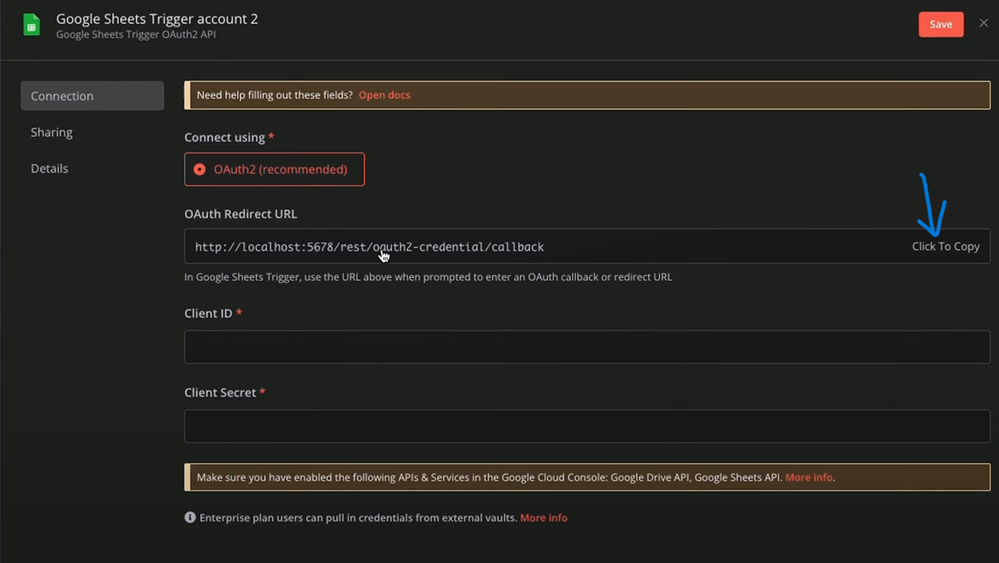

Choose **Application type = Web application**, name it (e.g., *n8n OAuth*), then **Create**.

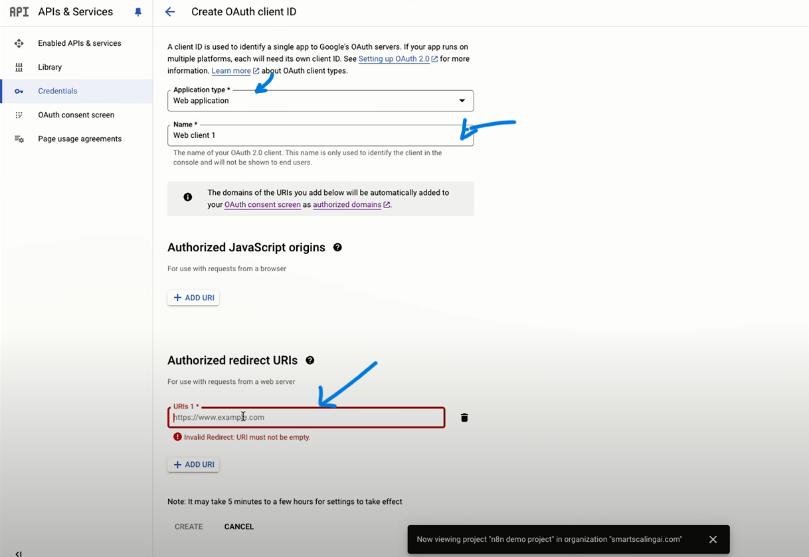

Copy the **Client ID** and **Client secret** (you can always find them later under *Credentials*).

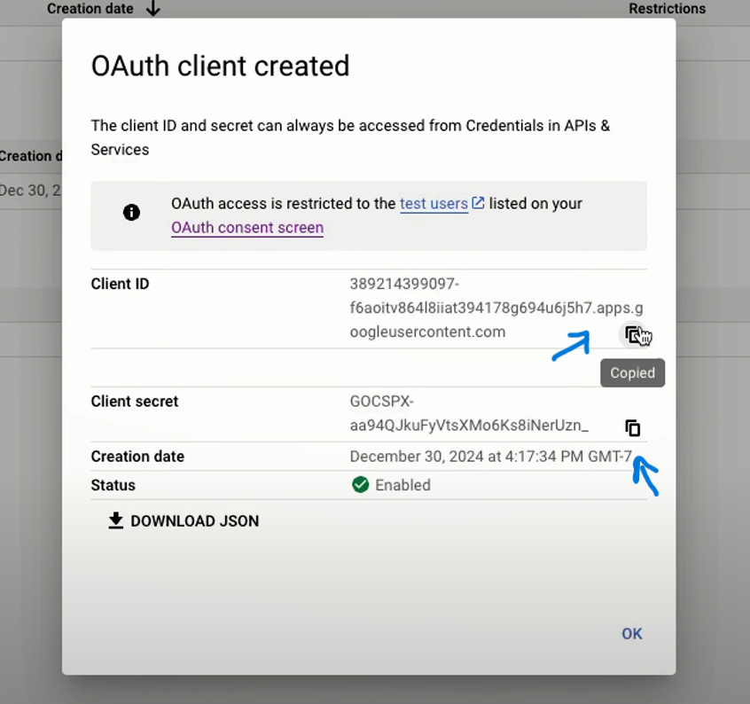

---

## 6) Enable required Google APIs
You must enable the APIs you plan to use with n8n. Open **APIs & Services → Library**.

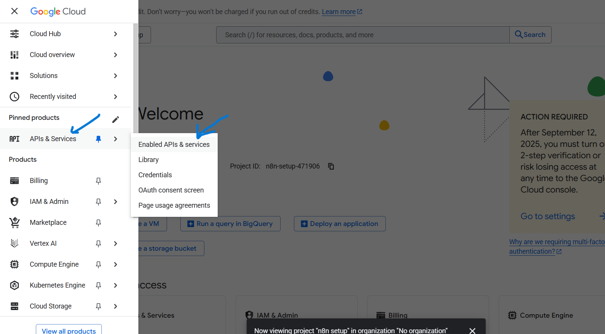
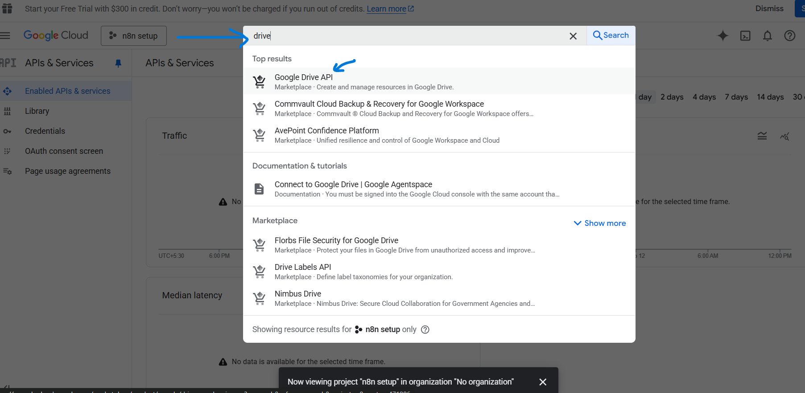

Enable each of the following (search by name → click **Enable**):
- **Google Drive API**  
  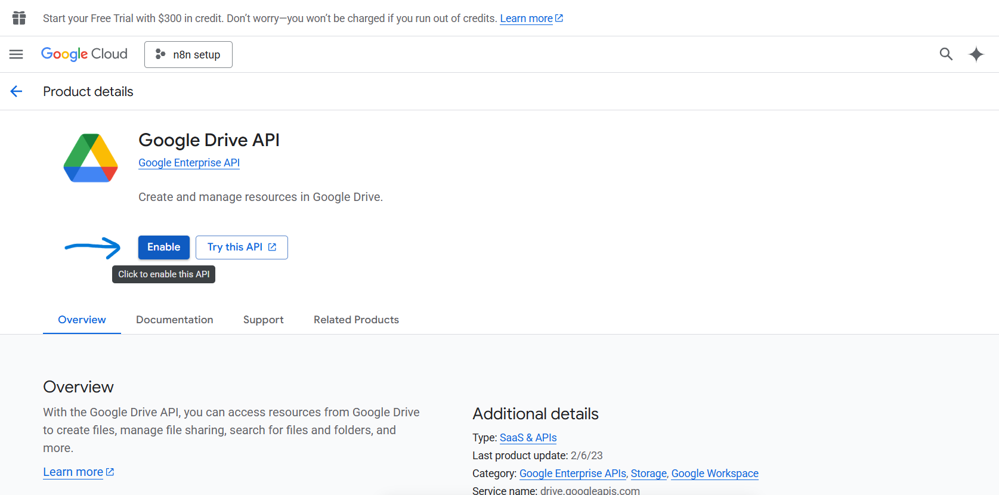

- **Google Sheets API**  
  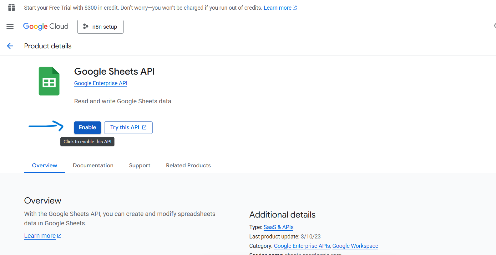

- **Gmail API**  
  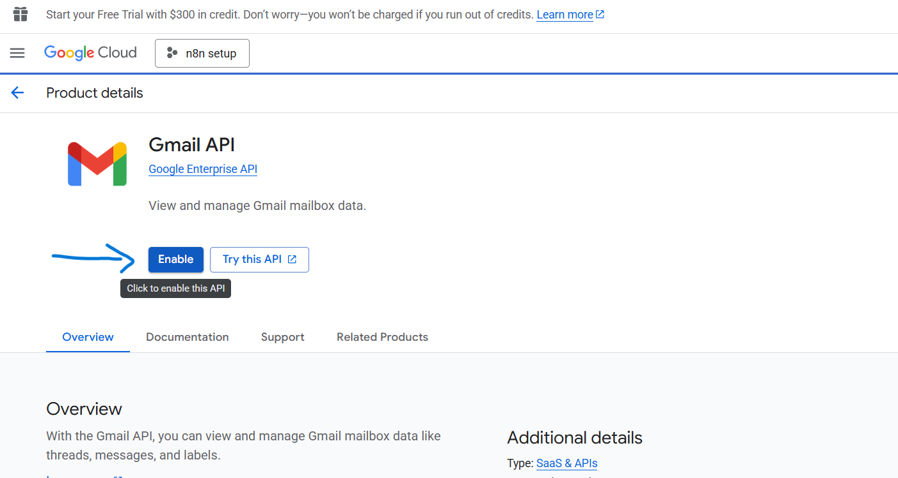

- **Google Calendar API**  
  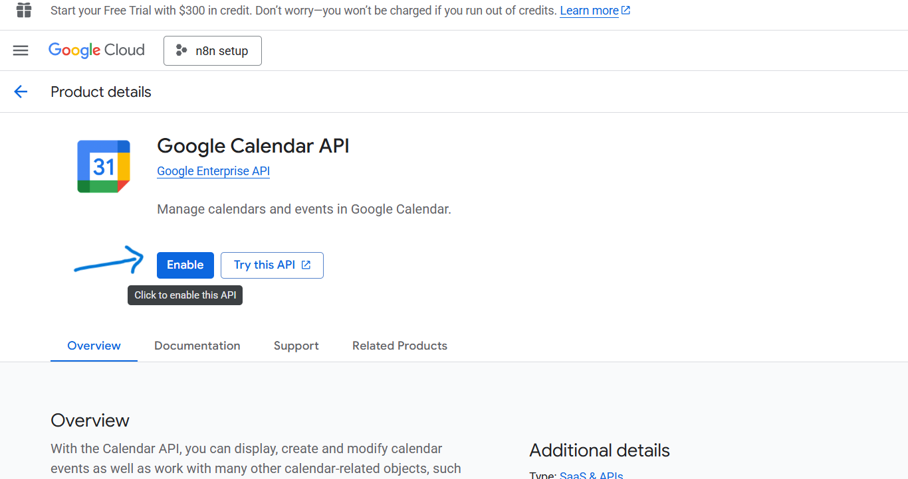

---

## 7) Paste credentials in n8n and connect
Back in n8n credentials:
- **Connect using:** OAuth2
- **OAuth Redirect URL:** (should match Step 1)
- **Client ID / Client Secret:** paste the values from Step 5
- Click **Sign in with Google**

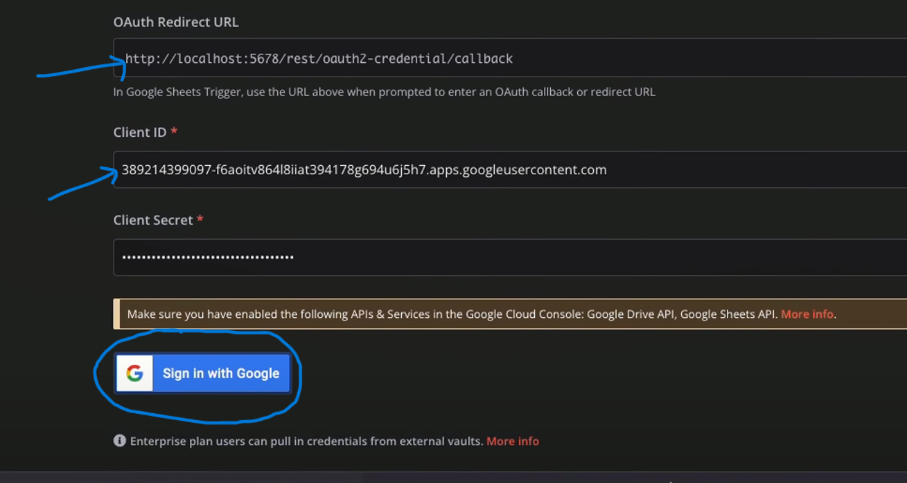

When successful, you’ll see the confirmation banner in n8n.

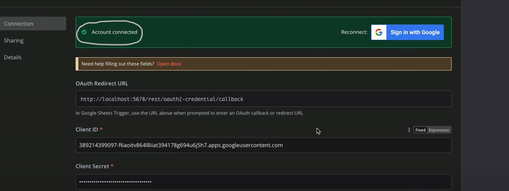

---

## 8) Quick validation
- Try a simple **Google Sheets → Append row** node using this credential.
- If you get **access_denied**, ensure the signing-in account is added under **Test users** (Step 4).
- If you see API errors, verify the specific API is **Enabled** (Step 6).

---

## Troubleshooting
- **Redirect URI mismatch**: The URI in Google Cloud must match the one from n8n **exactly** (no extra slashes).
- **Different base URL**: If you move from localhost to a public URL, add that new redirect URI in Google Cloud and create a new credential or update allowed URIs.
- **Org policies**: If on Google Workspace with restrictions, you may need admin approval for external apps/scopes.
