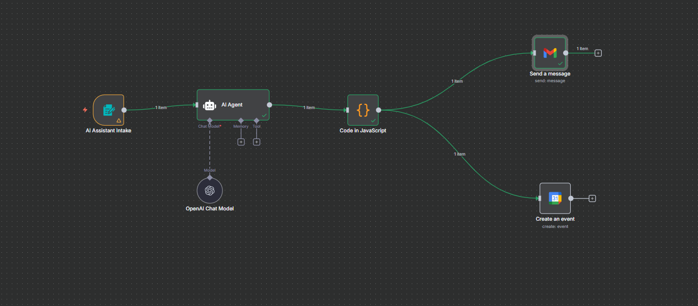
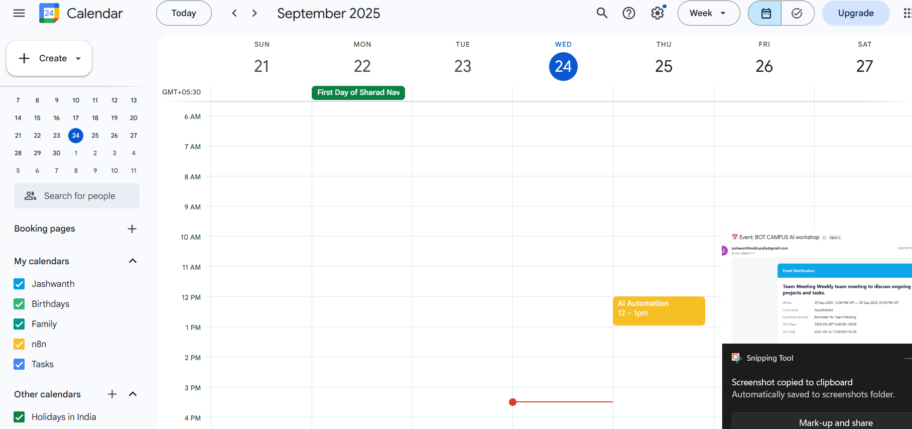
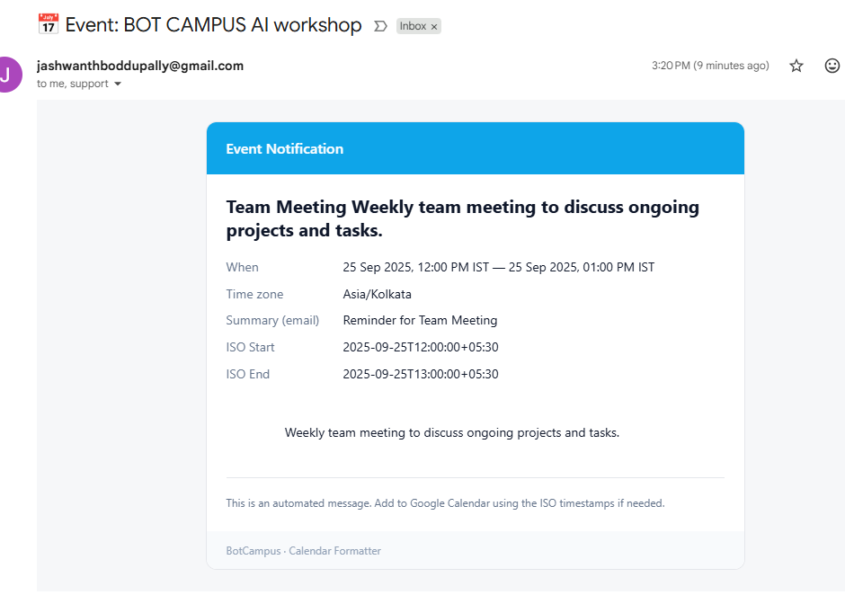

# AI Assistant — Form → AI Agent → Code → Google Calendar → Gmail
One-line goal: capture meeting details from a Form, have an AI Agent draft the email text, convert Date/Time to IST ISO in Code, create the Calendar event, and send a polished Gmail confirmation.



---

## At-a-glance outcomes
- Public **Form** with `Title, Description, Date (YYYY-MM-DD), Time Slot (12-hour), Email`.
- **AI Agent** outputs strict JSON: `summary, email_subject, email_html`.
- **Code (JS)** converts to `start_iso/end_iso` in **IST (+05:30)**; default duration **+60 min**.
- **Google Calendar** event is created with attendees.
- **Gmail** sends a styled, inline-CSS email (Gmail-friendly).

---

## Prereqs & Auth (do once)
- **n8n**: Cloud or Desktop.
- **OpenAI**: API key credential in n8n (**Credentials → OpenAI**).
- **Google OAuth2** credentials in n8n for:
  - **Google Calendar** (create events)
  - **Gmail** (send emails)
- A writable **Google Calendar** (primary is fine).

**Conventions**  
- **Timezone:** `Asia/Kolkata` (`+05:30`)  
- **Date input:** `YYYY-MM-DD` (e.g., `2025-09-25`)  
- **Time input:** `H:MM AM/PM` (e.g., `12:00 PM`)  
- **Duration default:** +60 minutes if no end provided

---

## Architecture snapshot
Form Trigger → OpenAI Chat Model → **AI Agent** → **Code (Combiner)** → Google Calendar (Create) & Gmail (Send)

---

## Step-by-Step (inline code at the exact step)

### 1) Form Trigger — **AI Assistant Intake** (collect details)
**Why:** Capture all inputs the rest of the flow needs.

- ➜ **a.** Click **+** → search **Form Trigger** → add it.  
- ➜ **b.** Create **Required** fields:  
  - **Title** (Type: **String**)  
  - **Description** (Type: **Text**)  
  - **Date** (Type: **Date**) → expects `YYYY-MM-DD`  
  - **Time Slot** (Type: **String**) → e.g., `12:00 PM`  
  - **Email** (Type: **Email**)  
- ➜ **c.** **Save** to get the **Public Form URL** (use for testing).  
- ➜ **d.** **Connections:** Form **main output → AI Agent (main input)**.  
- **Validate:** Open the public URL; you see all five fields and can submit.

---

### 2) OpenAI Chat Model — **OpenAI Chat Model** (provide model to Agent)
**Why:** Supplies a chat model to the AI Agent via the model port.

- ➜ **a.** Click **+** → **OpenAI → OpenAI Chat Model**.  
- ➜ **b.** **Credentials:** select your OpenAI API key.  
- ➜ **c.** **Model:** `gpt-4` or `gpt-4o-mini` (or any available Chat model).  
- ➜ **d.** **Connections:** **OpenAI Chat Model (output) → AI Agent (Chat Model port)**.  
- **Validate:** Node shows your model and credential with a green check.

---

### 3) AI Agent — **Turn form fields into email JSON (no date math)**
**Why:** Produce clean, **strict JSON** with subject + inline-styled HTML body.

- ➜ **a.** Click **+** → **AI → AI Agent**.  
- ➜ **b.** **Prompt Type:** `Define`.  
- ➜ **c.** **Paste this System Prompt (for this node):**
```text
ROLE
You are an executive assistant. You DO NOT compute ISO datetimes; another node will.
Your job: turn the form fields into a short, styled email summary.

INPUT FIELDS (any may be missing)
- Title
- Description
- Date (YYYY-MM-DD)
- Time Slot (H:MM AM/PM)
- Email

HARD RULES
1) Output MUST be valid JSON (no markdown fences, no trailing commas).
2) Keep body ≤ 120 words; subject ≤ 90 chars.
3) Use inline-styled HTML only; no images, no external CSS, no tracking pixels.
4) Mention Title, and Date/Time text if present.
5) Neutral, professional tone.

OUTPUT (STRICT JSON ONLY; keys exactly)
{
  "summary": "<2–4 sentence human summary>",
  "email_subject": "<<=90 chars; include date/time text if present>",
  "email_html": "<valid inline-styled HTML body (green header #10B981)>"
}
```
- ➜ **d.** **Connections:** **AI Agent (main output) → Code (JavaScript) main input**.  
- **Validate:** Run once with sample form data; preview shows an object containing `summary`, `email_subject`, `email_html`.

---

### 4) Code (JavaScript) — **Rename node:** `Combiner (Calendar + Email)`
**Why:** Convert Date + Time to **IST** `start_iso/end_iso` (+60 min default), and merge Agent output with form fields.

- ➜ **a.** Click **+** → **Code → Code** (JavaScript).  
- ➜ **b.** **Name:** `Combiner (Calendar + Email)`.  
- ➜ **c.** **Paste this JavaScript (for this node):**
```javascript
// ---------------- CONFIG ----------------
const FORM_NODE = 'AI Assistant Intake'; // exact form node label
const DEFAULT_DURATION_MINS = 60;        // event length if end not provided
const TZ_OFFSET = '+05:30';              // IST
// ---------------------------------------

// Helpers
function pad(n){ return String(n).padStart(2,'0'); }
function parseTime12h(s){
  if(!s) return {h24:9, m:0}; // default 09:00
  const m = String(s).trim().match(/^(\d{1,2}):(\d{2})\s*(AM|PM)$/i);
  if(!m) return {h24:9, m:0};
  let h = parseInt(m[1], 10);
  const min = parseInt(m[2], 10);
  const ap = m[3].toUpperCase();
  if(ap === 'AM'){ if(h === 12) h = 0; } else { if(h !== 12) h += 12; }
  return {h24:h, m:min};
}
function toISO(y,mo,d,hh,mi){ return `${y}-${pad(mo)}-${pad(d)}T${pad(hh)}:${pad(mi)}:00${TZ_OFFSET}`; }
function addDays(y,mo,d,days){
  const dt = new Date(Date.UTC(y,mo-1,d));
  dt.setUTCDate(dt.getUTCDate()+days);
  return {y:dt.getUTCFullYear(), m:dt.getUTCMonth()+1, d:dt.getUTCDate()};
}
function displayIST(dateStr, h24, mi){
  const months = ["Jan","Feb","Mar","Apr","May","Jun","Jul","Aug","Sep","Oct","Nov","Dec"];
  const [Y, M, D] = (dateStr||"").split("-").map(n=>parseInt(n,10));
  let mer='AM', h12=h24;
  if(h24===0){ h12=12; mer='AM'; }
  else if(h24===12){ h12=12; mer='PM'; }
  else if(h24>12){ h12=h24-12; mer='PM'; }
  return `${D} ${months[M-1]} ${Y}, ${pad(h12)}:${pad(mi)} ${mer} IST`;
}
function extractJson(s){
  const text = String(s ?? "");
  const a = text.indexOf("{");
  const b = text.lastIndexOf("}");
  if(a === -1 || b === -1 || b <= a) return {};
  try { return JSON.parse(text.slice(a, b+1)); } catch { return {}; }
}

// Read form values
let form = {};
try {
  form = $items(FORM_NODE, 0, 0)?.json ?? {};
} catch (e) {
  throw new Error(`Could not read items from node "${FORM_NODE}". Check the name is exact.`);
}
const titleForm = form.Title || "Untitled";
const descForm  = form.Description || "";
const dateStr   = form.Date || "";            // "YYYY-MM-DD"
const timeStr   = form["Time Slot"] || "";    // "12:00 PM"
const email     = form.Email || "";

// Build start/end in IST
const {h24, m} = parseTime12h(timeStr);
const [Y,MM,DD] = (dateStr||"").split("-").map(n=>parseInt(n,10));
const startISO = (Y && MM && DD) ? toISO(Y,MM,DD,h24,m) : "";
const startMins = h24*60 + m;
const endAll = startMins + DEFAULT_DURATION_MINS;
const carryDays = Math.floor(endAll / 1440);
const endH = Math.floor((endAll % 1440) / 60);
const endMin = (endAll % 1440) % 60;
let endISO = "";
if (Y && MM && DD){
  const {y, m:mo, d} = addDays(Y,MM,DD, carryDays);
  endISO = toISO(y,mo,d,endH,endMin);
}

// Read AI Agent output (email)
const aiRaw = $json.output ?? $json.text ?? $json.data ?? $json;
const ai = extractJson(aiRaw);
const aiSummary    = ai.summary || "";
const emailSubject = ai.email_subject || `Reminder: ${titleForm}${dateStr ? ' — '+dateStr : ''}${timeStr ? ', '+timeStr : ''}`;
let emailHtml = ai.email_html || "";

// Fallback HTML if Agent didn’t provide one
if(!emailHtml){
  emailHtml = `<html><body style="font-family:Arial,Helvetica,sans-serif;">
    <div style="background:#10B981;color:#fff;padding:12px;border-radius:10px;font-weight:600;">${titleForm}</div>
    <p>${aiSummary || descForm || 'Details not provided.'}</p>
    ${dateStr ? `<p><strong>Date:</strong> ${dateStr}</p>` : ''}
    ${timeStr ? `<p><strong>Time:</strong> ${timeStr} IST</p>` : ''}
  </body></html>`;
}

// Friendly display strings
const start_display = (Y && MM && DD) ? displayIST(dateStr, h24, m) : "";
const end_display   = (Y && MM && DD) ? displayIST(dateStr, endH, endMin) : "";

const attendees = email ? [email] : [];

return [{
  json: {
    // Calendar
    summary: titleForm,
    description: descForm,
    start_iso: startISO,
    end_iso: endISO,
    start_display,
    end_display,
    timezone: 'Asia/Kolkata',
    attendees,

    // Email
    emailTo: email,
    email_subject: emailSubject,
    email_summary: aiSummary,
    email_html: emailHtml
  }
}];
```
- **Validate:** Preview shows `start_iso` like `2025-09-25T12:00:00+05:30`, `end_iso` +60 min, and the email fields.

---

### 5) Google Calendar — **Create an event**
**Why:** Persist the event into your Google Calendar.

- ➜ **a.** Click **+** → **Google → Google Calendar**.  
- ➜ **b.** **Operation:** `Create`.  
- ➜ **c.** **Credentials:** your Google OAuth2 for Calendar.  
- ➜ **d.** **Calendar:** select your calendar.  
- ➜ **e.** Map fields (immediately after Code node):
  - **Title / Summary:** `={{ $json.summary }}`
  - **Description:** `={{ $json.description }}`
  - **Start:** `={{ $json.start_iso }}`
  - **End:** `={{ $json.end_iso }}`
  - **Attendees:** `={{ $json.attendees }}`
  - (Optional) **Reminders:** add popups (e.g., 30 & 10 min)



- ➜ **f.** If not placed right after Code, use cross-node:  
  `={{ $item(0).$node["Combiner (Calendar + Email)"].json.start_iso }}`
- **Validate:** Executing this node creates an event at the expected IST time.

---

### 6) Gmail — **Send a message**
**Why:** Notify attendees with a Gmail-friendly HTML email.

- ➜ **a.** Click **+** → **Google → Gmail**.  
- ➜ **b.** **Operation:** `Send a message`.  
- ➜ **c.** **Credentials:** your Google OAuth2 for Gmail.  
- ➜ **d.** **To:**  
  `={{ $json.emailTo || $json.attendees?.[0] }}`
- ➜ **e.** **Subject:**  
  `={{ $json.email_subject || ('📅 ' + ($json.summary || 'Event') + ($json.start_display ? ' — ' + $json.start_display : '')) }}`
- ➜ **f.** **Message (HTML)** — **Paste this (for this node):**
```html
<!doctype html>
<html>
  <body style="margin:0;padding:0;background:#f6f7f9;">
    <table width="100%" cellpadding="0" cellspacing="0" role="presentation">
      <tr>
        <td align="center" style="padding:24px;">
          <!-- Card -->
          <table width="600" cellpadding="0" cellspacing="0" role="presentation" style="width:600px;max-width:100%;background:#ffffff;border:1px solid #e5e7eb;border-radius:12px;overflow:hidden;">
            <!-- Banner -->
            <tr>
              <td style="padding:18px 22px;background:#0ea5e9;color:#fff;font:600 16px/1.4 Segoe UI, Roboto, Arial, sans-serif;">
                Event Notification
              </td>
            </tr>

            <!-- Content -->
            <tr>
              <td style="padding:22px;color:#0f172a;font:14px/1.55 Segoe UI, Roboto, Arial, sans-serif;">
                <!-- TITLE / SUMMARY -->
                <h2 style="margin:0 0 10px 0;font:700 20px/1.3 Segoe UI, Roboto, Arial, sans-serif;">
                  {{ $json.summary || 'Untitled Event' }}
                </h2>

                <!-- OPTIONAL SUBTITLE (DESCRIPTION) -->
                <p style="margin:0 0 12px 0;">
                  {{ $json.description || '' }}
                </p>

                <!-- QUICK ROWS -->
                <table role="presentation" cellpadding="0" cellspacing="0" width="100%" style="border-collapse:separate;border-spacing:0 8px;">
                  <tr>
                    <td width="130" style="color:#64748b;vertical-align:top;">When</td>
                    <td style="vertical-align:top;">
                      {{ $json.start_display || '' }}
                      {{ $json.end_display ? ' — ' + $json.end_display : '' }}
                    </td>
                  </tr>
                  <tr>
                    <td width="130" style="color:#64748b;vertical-align:top;">Time zone</td>
                    <td style="vertical-align:top;">
                      {{ $json.timezone || 'Asia/Kolkata' }}
                    </td>
                  </tr>
                  <tr>
                    <td width="130" style="color:#64748b;vertical-align:top;">Summary (email)</td>
                    <td style="vertical-align:top;">
                      {{ $json.email_summary || ($json.summary ? 'Reminder for ' + $json.summary : '') }}
                    </td>
                  </tr>
                  <tr>
                    <td width="130" style="color:#64748b;vertical-align:top;">ISO Start</td>
                    <td style="vertical-align:top;">
                      {{ $json.start_iso || '' }}
                    </td>
                  </tr>
                  <tr>
                    <td width="130" style="color:#64748b;vertical-align:top;">ISO End</td>
                    <td style="vertical-align:top;">
                      {{ $json.end_iso || '' }}
                    </td>
                  </tr>
                </table>

                <!-- DESCRIPTION (FULL) -->
                <div style="margin-top:14px;white-space:pre-wrap;">
                  {{ $json.description || '' }}
                </div>

                <hr style="margin:18px 0;border:none;border-top:1px solid #e5e7eb;">
                <div style="color:#64748b;font-size:12px;">
                  This is an automated message. Add to Google Calendar using the ISO timestamps if needed.
                </div>
              </td>
            </tr>

            <!-- Footer -->
            <tr>
              <td style="padding:12px 22px;background:#f8fafc;color:#94a3b8;font:12px/1.5 Segoe UI, Roboto, Arial, sans-serif;">
                BotCampus · Calendar Formatter
              </td>
            </tr>
          </table>
          <!-- /Card -->
        </td>
      </tr>
    </table>
  </body>
</html>
```

- **Validate:** Send a test; email renders card layout with your values.

---

## Key parameters (quick map)

| Node | Field | Value |
|---|---|---|
| Form Trigger | Fields | **Title (String, R), Description (Text, R), Date (Date, R), Time Slot (String, R), Email (Email, R)** |
| OpenAI Chat Model | Model | `gpt-4` or `gpt-4o-mini` |
| OpenAI Chat Model | Credentials | your **OpenAI** API key |
| AI Agent | Prompt Type | `Define` (paste the System Prompt at the node) |
| Code (JS) | Name | `Combiner (Calendar + Email)` |
| Google Calendar | Operation | `Create` |
| Google Calendar | Title | `={{ $json.summary }}` |
| Google Calendar | Description | `={{ $json.description }}` |
| Google Calendar | Start | `={{ $json.start_iso }}` |
| Google Calendar | End | `={{ $json.end_iso }}` |
| Google Calendar | Attendees | `={{ $json.attendees }}` |
| Gmail | To | `={{ $json.emailTo || $json.attendees?.[0] }}` |
| Gmail | Subject | `={{ $json.email_subject || ('📅 ' + ($json.summary || 'Event') + ($json.start_display ? ' — ' + $json.start_display : '')) }}` |
| Gmail | Message (HTML) | paste the HTML block at the Gmail node |

---

## End-to-End Test (IST)

1) **Submit the Form** (Public URL):  
   - Title: `Team Meeting`  
   - Description: `Weekly check-in`  
   - Date: `2025-09-25`  
   - Time Slot: `12:00 PM`  
   - Email: `you@example.com`  
2) **Execute workflow** (or set Active to auto-run).  
3) **AI Agent preview:** JSON with `summary, email_subject, email_html`.  
4) **Code preview:**  
   - `start_iso`: `2025-09-25T12:00:00+05:30`  
   - `end_iso`: `2025-09-25T13:00:00+05:30`  
   - `start_display / end_display` includes `IST`.  
5) **Google Calendar:** Event exists 12:00–1:00 PM IST with attendee.  
6) **Gmail:** Email received with the blue banner card and filled fields.

---

## Troubleshooting (precise fixes)

- **“Could not read items from node …”**  
  → In Code, `FORM_NODE` must equal the **Form node label**: `AI Assistant Intake`.  
- **Wrong time or empty ISO**  
  → Form’s **Time Slot** must be `H:MM AM/PM` (e.g., `1:05 PM`), not `13:05`. Ensure **Date** is `YYYY-MM-DD`.  
- **No email sent**  
  → Reconnect **Gmail** credential; ensure **To** is a valid address and domain allows external mail.  
- **No event created**  
  → In Calendar node, hover field pills for **Start/End**; confirm full ISO from **Combiner**.  
- **Email HTML looks broken**  
  → Ensure you pasted the **entire** HTML block; Gmail prefers inline CSS only.  
- **OAuth 401/403**  
  → Reconnect Google OAuth2; confirm scopes include Calendar create and Gmail send.

---

## What to deliver
- This full README-style guide with inline code blocks.
- Screenshots embedded as:
  - `images/01-canvas-overview.png`
  - `images/02-calendar-view.png`
  - `images/03-email-proof.png`
