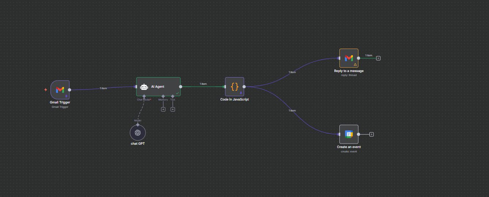
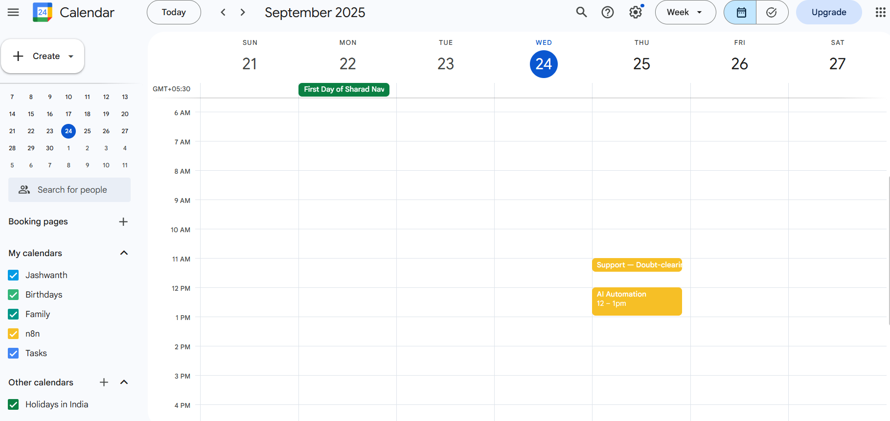
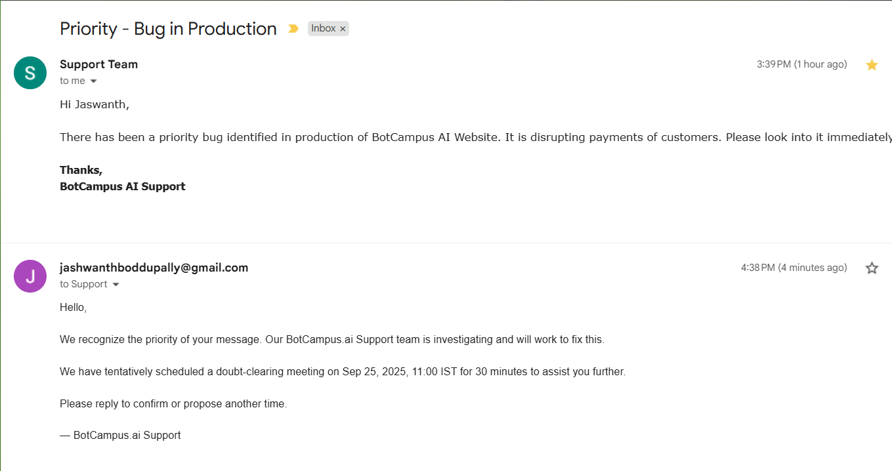

# Intelligent Email → Priority Triage → Calendar Booking (IST)
One-line goal: watch Gmail for urgent emails (priority/emergency), auto-draft a professional reply, and book a doubt‑clearing Google Calendar slot—then reply in the **same thread**.





---

## At‑a‑glance outcomes
- **Gmail Trigger** polls Inbox and exposes `threadId`, Subject, and Body.
- **AI Agent** classifies urgency and returns **strict JSON** with HTML reply + IST meeting times.
- **Code (JS)** safely parses Agent JSON and outputs flat fields.
- **Google Calendar** creates a 30‑min hold at **received+1 hr** in **Asia/Kolkata**.
- **Gmail** replies **in-thread** with inline‑styled HTML.

---

## Prereqs & Auth (do once)
- **n8n**: Cloud or Desktop.
- **OpenAI**: API Key credential in n8n (**Credentials → OpenAI**).
- **Google OAuth2** credentials in n8n for:
  - **Gmail** (read/modify/send) — recommended scope: `gmail.modify` (or `gmail.send` for reply).
  - **Google Calendar** (create events).
- **Timezone:** `Asia/Kolkata` (`+05:30`).
- **Conventions:** Meeting start = *received_at + 1 hour*, duration **30 minutes** (configurable in the Agent prompt).

---

## Architecture snapshot
**Gmail Trigger → OpenAI Chat Model → AI Agent → Code (Normalize) → Gmail: Reply to a message + Google Calendar: Create an event**

Folder `workflow/triage_calendar_booking.json` contains an import‑ready n8n workflow JSON.

---

## Step‑by‑Step (inline code at the exact step)

### 1) Gmail Trigger — watch for new mail
**Why:** Provide `threadId`, `Subject`, and content for downstream logic.

- ➜ **a.** Click **+** → **Gmail Trigger**.  
- ➜ **b.** **Poll Times:** `Every minute` (start with default).  
- ➜ **c.** (Optional) **Filters:** add label/subject filters later.  
- ➜ **d.** **Credentials:** select Gmail OAuth.  
- ➜ **e.** **Connections:** **Gmail Trigger → AI Agent (main)**.  
- **Validate:** Execute once; see an item with `Subject`, `From`, `threadId`.

---

### 2) OpenAI Chat Model — provide the model to the Agent
**Why:** The Agent needs a chat model to reason and emit strict JSON.

- ➜ **a.** Click **+** → **OpenAI → OpenAI Chat Model**.  
- ➜ **b.** **Credentials:** your OpenAI API key.  
- ➜ **c.** **Model:** `gpt-4.1-mini` (or `gpt-4o-mini`/`gpt-4`).  
- ➜ **d.** **Connections:** **Chat Model (output) → AI Agent (Chat Model port)**.  
- **Validate:** Node shows your model and a green credential check.

---

### 3) AI Agent — prioritize + compose reply JSON (IST; no downstream math)
**Why:** Decide urgency and produce **strict JSON** with reply + meeting times in IST.

- ➜ **a.** Click **+** → **AI → AI Agent**.  
- ➜ **b.** **Prompt Type:** `Define`.  
- ➜ **c.** **Paste this System Prompt (for this node only):**
```text
ROLE
You are an Email Assistant AI Agent for BotCampus.ai Support.
You continuously analyze incoming Gmail messages and decide whether to send an immediate, professional reply and book a doubt-clearing meeting on the calendar.

INPUT CONTRACT (from upstream nodes)

You will receive the following fields (names are exact):

subject: string — email subject
body: string — plain-text or lightly-HTML email body
from_name: string — sender display name (may be empty)
from_email: string — sender email
received_at_iso: string — RFC-3339 timestamp of when the email was received (e.g., 2025-09-24T06:30:21.095-04:00)
now_iso: string — RFC-3339 timestamp of “now” injected by workflow (e.g., from {{$now}})

Configuration (override via prompt injection or upstream variables if needed)

KEYWORDS = ["priority", "emergency"] // case-insensitive, whole word
TIMEZONE = "Asia/Kolkata" // output calendar times in this zone (+05:30)
MEETING_OFFSET_HOURS = 1 // schedule start = received_at + 1 hour
MEETING_DURATION_MIN = 30 // 30-minute meeting
CALENDAR_TITLE_PREFIX = "Support — Doubt-clearing: "
BRAND = "BotCampus.ai"

Note: If the user’s instructions show a different offset (e.g., 2 hours), you may change MEETING_OFFSET_HOURS accordingly. Default is 1 hour.

DECISION RULES
Keyword detection (must/should reply):
Normalize subject and body to lower case.
Detect whole-word matches for any KEYWORDS. Regex example: \b(priority|emergency)\b (case-insensitive).
If any match exists → should_send = true, priority_detected = true.
Else → should_send = false, priority_detected = false, but still return the JSON with reason.

Reply content policy (when should_send = true):
Tone: calm, empathetic, professional, concise.
Acknowledge urgency and confirm that BotCampus.ai Support is on it.
Include a tentative calendar hold exactly MEETING_OFFSET_HOURS after received_at_iso, duration MEETING_DURATION_MIN.
Ask the sender to confirm or propose another time if it doesn’t work.
Do not invent ticket numbers.
Avoid technical promises you cannot guarantee; say “we’re investigating”.

Calendar time computation:
Parse received_at_iso (which may have any offset).
Compute start_time = received_at + MEETING_OFFSET_HOURS.
Compute end_time = start_time + MEETING_DURATION_MIN.
Convert both to RFC-3339 in TIMEZONE (Asia/Kolkata, +05:30).
Provide a human-readable local time string for the email body (e.g., “Sep 24, 2025, 18:00 IST”).
You are not creating the event yourself; you only output the fields so downstream nodes can create it.

Safety & formatting:
Do not include markdown in the output—JSON only.
HTML in reply_html must be simple, inline-safe, and email-friendly (no external CSS).
Preserve any sender name/email as provided; don’t guess.

OUTPUT CONTRACT (JSON ONLY — no markdown, no commentary)
Return exactly:
{
  "should_send": true,
  "reason": "string",
  "priority_detected": true,
  "reply_subject": "string",
  "reply_html": "string",
  "meeting": {
    "summary": "string",
    "description": "string",
    "start_iso": "YYYY-MM-DDTHH:mm:ss+05:30",
    "end_iso": "YYYY-MM-DDTHH:mm:ss+05:30",
    "timezone": "Asia/Kolkata"
  },
  "metadata": {
    "received_at_iso": "string",
    "computed_from": "received_at + MEETING_OFFSET_HOURS",
    "offset_hours": 1,
    "duration_min": 30,
    "keywords_matched": ["priority"]
  }
}

If no keyword match, return the same JSON with should_send=false, priority_detected=false, and empty strings for reply/meeting fields, plus a helpful reason.

REPLY COMPOSITION GUIDELINES (when should_send = true)
reply_subject:
"[BotCampus.ai] We’re on it — {brief issue cue}" (fallback: “… — Support update”)
reply_html:
- Greeting with sender name/email
- Acknowledge urgency
- “Our BotCampus.ai Support team is investigating and will work to fix this.”
- Tentative meeting details in IST + short agenda
- CTA: “Reply to confirm or propose another time.”
- “— BotCampus.ai Support”
```
- ➜ **d.** **Connections:** **AI Agent (main) → Code in JavaScript (main)**.  
- **Validate:** Test with a subject containing “priority”; output must be **strict JSON** with `meeting.start_iso` in IST.

---

### 4) Code in JavaScript — normalize & expose fields
**Why:** Strip code fences, parse JSON safely, and emit flat fields for Calendar + Gmail.

- ➜ **a.** Click **+** → **Code → Code** (JavaScript).  
- ➜ **b.** **Name:** `Normalize Agent JSON` (or keep default).  
- ➜ **c.** **Paste this (for this node only):**
```javascript
/**
 * Function Node — Parse & Normalize AI Email-Agent Output
 * Safe against noisy outputs. Emits flat fields for Calendar + Gmail.
 */
function pickRaw(item) {
  return (
    item.json?.output ??
    item.json?.text ??
    item.json?.data ??
    item.json?.choices?.[0]?.message?.content ??
    item.json?.choices?.[0]?.text ??
    ''
  );
}
function stripCodeFences(s) {
  if (typeof s !== 'string') return '';
  return s
    .replace(/^`{3}[\s\S]*?\n/, '')
    .replace(/```$/m, '')
    .replace(/```[\s\S]*?```/g, (m) => m.replace(/```/g, ''));
}
function extractFirstJsonBlock(s) {
  const openers = ['{', '['];
  for (const opener of openers) {
    const closer = opener === '{' ? '}' : ']';
    let depth = 0, start = -1;
    for (let i = 0; i < s.length; i++) {
      const ch = s[i];
      if (ch === opener) { if (depth === 0) start = i; depth++; }
      else if (ch === closer) { if (depth > 0) depth--; if (depth === 0 && start !== -1) return s.slice(start, i + 1); }
    }
  }
  return null;
}
function safeJsonParse(s) { try { return JSON.parse(s); } catch { return null; } }
function coerceStrings(v) { return (v == null) ? '' : String(v); }
function normalize(ai) {
  const out = {
    should_send: false, reason: '', priority_detected: false,
    reply_subject: '', reply_html: '',
    meeting_summary: '', meeting_description: '',
    meeting_start_iso: '', meeting_end_iso: '', meeting_timezone: '',
    _meta: {}
  };
  if (ai && typeof ai === 'object') {
    out.should_send = !!ai.should_send;
    out.reason = coerceStrings(ai.reason);
    out.priority_detected = !!ai.priority_detected;
    out.reply_subject = coerceStrings(ai.reply_subject);
    out.reply_html = coerceStrings(ai.reply_html);
    if (ai.meeting && typeof ai.meeting === 'object') {
      out.meeting_summary = coerceStrings(ai.meeting.summary);
      out.meeting_description = coerceStrings(ai.meeting.description);
      out.meeting_start_iso = coerceStrings(ai.meeting.start_iso);
      out.meeting_end_iso = coerceStrings(ai.meeting.end_iso);
      out.meeting_timezone = coerceStrings(ai.meeting.timezone);
    }
    out._meta = ai.metadata ?? {};
  }
  return out;
}
return items.map((item) => {
  const raw0 = pickRaw(item);
  const raw = stripCodeFences(String(raw0 || '').trim());
  let parsed = safeJsonParse(raw) || safeJsonParse(extractFirstJsonBlock(raw) || '');
  const norm = normalize(parsed);
  item.json = {
    ...item.json,
    should_send: norm.should_send,
    reason: norm.reason,
    priority_detected: norm.priority_detected,
    reply_subject: norm.reply_subject,
    reply_html: norm.reply_html,
    meeting_summary: norm.meeting_summary,
    meeting_description: norm.meeting_description,
    meeting_start_iso: norm.meeting_start_iso,
    meeting_end_iso: norm.meeting_end_iso,
    meeting_timezone: norm.meeting_timezone,
    _meta: norm._meta,
    _raw_ai: String(raw0 || '')
  };
  item.json._is_valid_reply = !!(item.json.reply_subject && item.json.reply_html);
  item.json._is_valid_meeting = !!(item.json.meeting_start_iso && item.json.meeting_end_iso);
  return item;
});
```
- **Validate:** See `reply_subject`, `reply_html`, and `meeting_*` fields; flags `_is_valid_reply: true`, `_is_valid_meeting: true`.

---

### 5) Gmail — Reply to a message (same thread)
**Why:** Send the HTML reply back to the original conversation.

- ➜ **a.** Click **+** → **Gmail** → **Reply to a message**.  
- ➜ **b.** **Resource:** `Thread`  | **Operation:** `Reply`.  
- ➜ **c.** **Thread ID:**  
  `={{ $('Gmail Trigger').item.json.threadId }}`  
- ➜ **d.** **Email Type:** `HTML`.  
- ➜ **e.** **Message:**  
  `={{ $('Code in JavaScript').item.json.reply_html }}`  
- ➜ **f.** **Credentials:** Gmail OAuth.  
- **Validate:** Reply appears in the same Gmail thread.

---

### 6) Google Calendar — Create an event
**Why:** Place a 30‑min hold at received+1 hr, in IST.

- ➜ **a.** Click **+** → **Google Calendar** → **Create an event**.  
- ➜ **b.** **Calendar:** choose your calendar.  
- ➜ **c.** **Start:** `={{ $json.meeting_start_iso }}`  
- ➜ **d.** **End:** `={{ $json.meeting_end_iso }}`  
- ➜ **e.** **Additional fields → Summary:** `={{ $json.meeting_summary }}`  
- ➜ **f.** **Additional fields → Description:** `={{ $json.meeting_description }}`  
- ➜ **g.** **Credentials:** Calendar OAuth.  
- **Validate:** Event appears at the computed IST slot (e.g., “Support — Doubt‑clearing”).

---

## Node list (order)
1. **Gmail Trigger**  
2. **OpenAI Chat Model**  
3. **AI Agent**  
4. **Code in JavaScript**  
5. **Gmail: Reply to a message**  
6. **Google Calendar: Create an event**

---

## Key parameters (quick map)

| Node | Field | Value |
|---|---|---|
| Gmail Trigger | Poll | `Every minute` |
| Chat Model | Model | `gpt-4.1-mini` (or similar) |
| AI Agent | Prompt Type | `Define` (paste prompt at Step 3) |
| Code in JS | Output flags | `_is_valid_reply`, `_is_valid_meeting` |
| Gmail Reply | Thread ID | `={{ $('Gmail Trigger').item.json.threadId }}` |
| Gmail Reply | Message (HTML) | `={{ $('Code in JavaScript').item.json.reply_html }}` |
| Calendar Create | Start/End | `={{ $json.meeting_start_iso }}`, `={{ $json.meeting_end_iso }}` |
| Calendar Create | Summary/Desc | `={{ $json.meeting_summary }}`, `={{ $json.meeting_description }}` |

---

## End‑to‑End Test (IST)
1) Send yourself an email with Subject containing **“priority”**.  
2) **Execute workflow** (or set **Active**).  
3) **AI Agent** output: `should_send: true`, `meeting.start_iso` and `.end_iso` in IST.  
4) **Code** output: `_is_valid_reply: true`, `_is_valid_meeting: true`.  
5) **Gmail**: reply lands **in the same thread**.  
6) **Calendar**: event exists at **received+1 hr** for **30 min**.

---

## Troubleshooting (precise fixes)
- **No reply sent** → Check Gmail **Reply** node credentials and **Thread ID** expression.  
- **Agent output not parsed** → Ensure **strict JSON** (no code fences); the Code node strips fences but cannot fix malformed JSON.  
- **Wrong time zone** → Agent must output ISO strings with `+05:30` and `"timezone": "Asia/Kolkata"`.  
- **Calendar event missing** → Hover Start/End fields; confirm ISO strings from Code node.  
- **Gmail trigger idle** → Ensure workflow is **Active** and polling schedule is reasonable.  

---

## Files in this package
- `README.md` — this guide
- `images/01-flow-canvas.png`, `images/02-calendar-event.png`, `images/03-gmail-thread.png`
- `workflow/triage_calendar_booking.json` — n8n import JSON (if provided)
