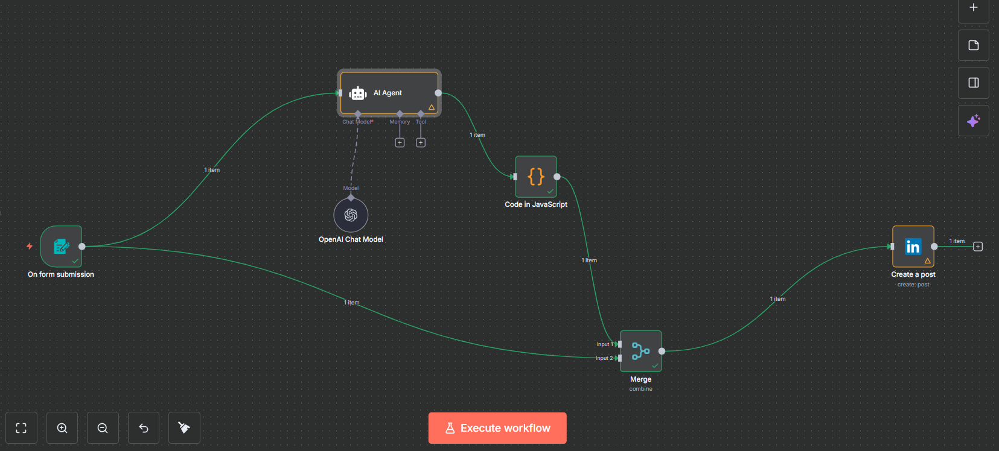

# AI LinkedIn Auto-Post (n8n) — Deep Steps + Node Modes
**Goal:** Submit a short form + optional image → AI generates a clean LinkedIn post → publish from your **personal profile**.

---

## At-a-Glance Outcomes
- OAuth2 for LinkedIn (personal) set up correctly—**first**.
- n8n flow: **Form → AI Agent → Code → Merge (Combine) → LinkedIn: Create a post**.
- Bullet-proof **Merge** behavior (understand **Combine** vs other modes).
- Inline, ready-to-paste **System Prompt**, **User Prompt**, **Code**, **LinkedIn expressions**.
- Optional **Wait Until** schedule using `scheduled_iso`.

---

## Prereqs & Auth (do this first)

### 1) Create a LinkedIn Developer App (personal posting)
➜ a. Go to **LinkedIn Developer Portal → My apps → Create app**  
➜ b. Fill **App name**, **Company** (use your profile if no org), **Logo**, **Business email**  
➜ c. Request **Products/Permissions**:  
- `w_member_social` (post as a member)  
- `r_liteprofile` (resolve your member URN)  
*(If you also want to post to a Page later: add `w_organization_social` + `r_organization_social` and ensure you are a Page Admin.)*  
➜ d. Copy **Client ID** and **Client Secret**.

### 2) Set Redirect URL for n8n
- **n8n Cloud:** your workspace URL is already public.  
- **Self-hosted:** set **Settings → Public URL** to your HTTPS domain.  
  **Redirect URL format (paste into your LinkedIn app):**
  ```
  https://YOUR_N8N_DOMAIN/rest/oauth2-credential/callback
  ```

### 3) Create LinkedIn OAuth2 in n8n
➜ a. **Credentials → New → LinkedIn → Community Management OAuth2**  
➜ b. Paste **Client ID** and **Client Secret**  
➜ c. **Turn OFF** any **Organization/Page** support if you’re posting to your personal profile only  
➜ d. **Connect OAuth2** → approve on LinkedIn → **Save**  
*(To post to a Page later, edit this same credential, toggle Org support ON, reconnect, and pick the Page in the node.)*

---

## Architecture Snapshot
Nodes & flow: **Form** → **AI Agent (OpenAI Chat Model)** → **Code (JavaScript)** → **Merge (Combine)** → **LinkedIn: Create a post**



**Node List (order):**
1. **On form submission**  
2. **OpenAI Chat Model**  
3. **AI Agent**  
4. **Code (JavaScript)**  
5. **Merge** (Mode: Combine)  
6. **LinkedIn → Create a post**

---

## Step-by-Step (Deeper)

### 1) Form — On form submission
➜ a. Add **On form submission**  
➜ b. Fields:
- **Prompt** (Text, required)
- **Schedule Time** (Text, optional; e.g., `01:30 PM IST`)
- **image** (File upload; binary name must be **`image`**)

> Why: LinkedIn node reads the **Binary Property** named `image`.

---

### 2) Chat Model
➜ a. Drop **OpenAI Chat Model** (e.g., `gpt-4.1-mini`)  
➜ b. Set your **OpenAI credential**  
➜ c. Wire **Model output → AI Agent (Chat Model)**

---

### 3) AI Agent
**System Message** (paste into **AI Agent → System**):
```txt
You are a helpful LinkedIn Post creator assistant.

Create professional, skimmable LinkedIn posts:
- Keep it concise and value-focused.
- Use bullets and emojis when helpful.
- Max 3 relevant hashtags.
- If an external link exists, add a one-line hook before it.
- If an image is attached, include “[image attached]” note in context.

Return STRICT JSON only:
{
  "posts": [
    {
      "text": "string",
      "Schedule_time": "HH:mm AM/PM IST or 24h",
      "link": "optional",
      "image_url": "optional"
    }
  ]
}
```

**User Prompt Template** (paste into **AI Agent → User**):
```txt
Brief: {{$json["Prompt"]}}
Preferred tone: friendly, practical
Count: 1
Schedule_time: {{$json["Schedule Time"]}}
```

---

### 4) Code (JavaScript) — normalize output
**Node:** Code in JavaScript → paste this **exact code**:
```javascript
/**
 * Normalize AI output for LinkedIn posting.
 * Exposes: post_text, link, image_url, scheduled_iso
 * IST timezone math for optional scheduling helpers.
 */
const TZ_OFFSET_MIN = 330; // IST

function parseMaybeJSON(v) {
  if (typeof v === 'string') {
    try { return JSON.parse(v); } catch (_) {}
    const m = v.match(/^\s*```(?:json)?\s*([\s\S]*?)\s*```/i);
    if (m) { try { return JSON.parse(m[1]); } catch (_) {} }
  }
  return v;
}
function unescapeNewlines(s) {
  return String(s).replace(/\\n/g, '\n').replace(/\r\n/g, '\n');
}
function todayIST() {
  const now = new Date();
  const ist = new Date(now.getTime() + TZ_OFFSET_MIN * 60 * 1000);
  const Y = ist.getUTCFullYear();
  const M = ist.getUTCMonth() + 1;
  const D = ist.getUTCDate();
  return `${Y}-${String(M).padStart(2,'0')}-${String(D).padStart(2,'0')}`;
}
function istWallToUTCISO(timeStr) {
  if (!timeStr) return null;
  let t = timeStr.replace(/\s*IST\s*$/i, '').trim();
  const pm = /\bpm\b/i.test(t);
  const am = /\bam\b/i.test(t);
  t = t.replace(/\s*(am|pm)\s*$/i, '').trim();
  let [hh, mm] = t.split(':').map(Number);
  if (!isFinite(hh) || !isFinite(mm)) return null;
  if (pm && hh < 12) hh += 12;
  if (am && hh === 12) hh = 0;
  const [Y, M, D] = todayIST().split('-').map(Number);
  const ist = new Date(Date.UTC(Y, M - 1, D, hh, mm));
  const utc = new Date(ist.getTime() - TZ_OFFSET_MIN * 60 * 1000);
  return utc.toISOString();
}

// Read and unwrap agent output
let ai = parseMaybeJSON($json);
if (typeof ai?.output !== 'undefined') ai = parseMaybeJSON(ai.output);
if (Array.isArray(ai?.posts) && ai.posts.length) ai = ai.posts[0];

const textRaw = ai?.text ?? '';
const link = ai?.link || undefined;
const image_url = ai?.image_url || ai?.imageUrl || undefined;
const scheduled_iso = istWallToUTCISO(String(ai?.Schedule_time || '').trim());

const post_text = unescapeNewlines(textRaw);
return [{ json: { post_text, link, image_url, scheduled_iso } }];
```

---

### 5) Merge — **Mode & Operations (the important part)**
**Node:** Merge

- **Mode:** **Combine**  
  - **What it does:** merges the JSON from **Input 1** and **Input 2** into **one** item.  
  - **Why here:** You want the **Form data** (binary `image`, prompt) and the **Code output** (`post_text`, etc.) together in the final payload.
- **Combine by:** **Combine All**  
  - **Behavior:** If both sides output 1 item each, you get 1 merged item with **all fields**.  
  - **Conflict rule:** When duplicate keys exist, fields from **Input 2** overwrite Input 1. Keep the **Code node** as **Input 2** to ensure `post_text` wins.

**Wiring Tip:**  
- Connect **Form → Merge (Input 1)**  
- Connect **Code → Merge (Input 2)**

> Other modes: **Append** (concatenate lists), **Pass Through** (forward one side), **Merge by Key**/**Multiplex** (older UI; not needed here).

---

### 6) LinkedIn — Create a post
**Node:** LinkedIn  
**Operation:** **Create a post**  
**Key fields for personal posting:**
- **Person:** choose **your profile** (member URN appears)  
- **Text:** *(paste expression)*  
```txt
={{ $json.post_text }}
```
- **Share Media Category:**  
  - `IMAGE` → when sending an image  
  - `NONE` → text-only posts
- **Binary Property (Name):** *(exactly)*  
```txt
image
```

> If switching to **Organization** posting later: toggle org support in credential, reconnect OAuth, select **Organization** (Page URN), ensure `w_organization_social` + `r_organization_social` and Page Admin role.

---

## Optional Scheduling (clean pattern)

### Add a **Wait** → **Wait Until** node **before** LinkedIn
**Field:** **Wait Until** → paste:
```txt
={{ $json.scheduled_iso }}
```
**Behavior:**  
- If `scheduled_iso` is null → releases immediately.  
- If valid ISO → pauses until that UTC time.  
*(LinkedIn API doesn’t natively schedule member posts; n8n does via Wait.)*

---

## Copy-Paste Blocks (Quick Reference)
**Redirect URL (LinkedIn app)**
```txt
https://YOUR_N8N_DOMAIN/rest/oauth2-credential/callback
```

**AI Agent → User Prompt**
```txt
Brief: {{$json["Prompt"]}}
Preferred tone: friendly, practical
Count: 1
Schedule_time: {{$json["Schedule Time"]}}
```

**LinkedIn → Text**
```txt
={{ $json.post_text }}
```

**LinkedIn → Binary Property**
```txt
image
```

**Wait Until (optional)**
```txt
={{ $json.scheduled_iso }}
```

---

## Testing & Validation
1) **Execute workflow**  
2) Form:
   - **Prompt:** “The future of AI in ops—give 5 bullets + 2 emojis.”  
   - **Schedule Time:** *(empty for immediate)*  
   - **image:** attach JPG/PNG (field name `image`)  
3) **Code** output → has `post_text`  
4) **Merge** output → retains `image` binary + `post_text`  
5) **LinkedIn** node → success; verify on your profile


---

## Repo Contents
- `README.md` (this file)  
- `images/01-overview.png` (workflow)  
- `images/02-post.png` (result)  
- `workflows/AI LinkedIn Auto Post.json` (n8n export)

---

**License:** MIT (optional — customize as needed)
