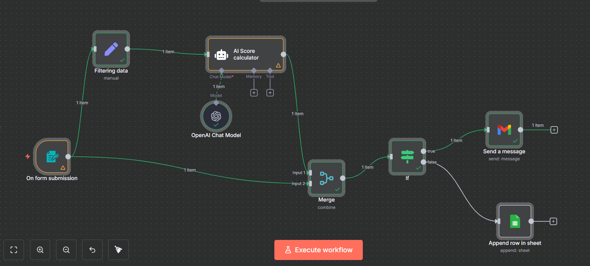
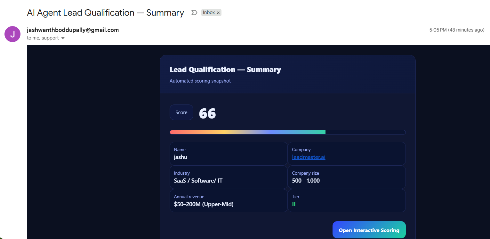
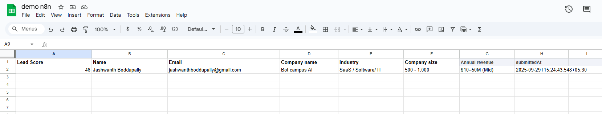

# AI Lead Scoring Agent (n8n) — Ultra‑Clear Workshop

**Goal:** Collect a lead via a form, compute a **0–100 score** with an AI rubric, then:
- **Score ≥ 60** → send a rich HTML **email** to your team.
- **Score < 60** → **append** the lead to **Google Sheets** for nurture.

---

## S — Setup (what you need to get this done)
- **n8n** (Cloud or self-hosted) with access to the node panel.
- **OpenAI** credential in n8n (API key).
- **Google** credentials in n8n:
  - **Gmail OAuth2** (to send the summary email).
  - **Google Sheets OAuth2** (to append rows).
- A Google Sheet with columns (first row headers):  
  `Lead Score | Name | Email | Company name | Industry | Company size | Annual revenue | submittedAt`
- Timezone doesn’t affect scoring, but your form timestamps will use n8n’s server TZ.
- (Optional but recommended) Make dropdown labels tidy (no trailing spaces, consistent spelling).

> Done right if: n8n shows connected credentials and you can open your Sheet and Gmail from the nodes.

---

## U — Understand (architecture at a glance)

1. **Form Trigger** → collects lead info.  
2. **Set (Filtering data)** → normalizes fields for the model.  
3. **OpenAI Chat Model** → provides the LLM.  
4. **Agent (AI Score calculator)** → returns a single integer score.  
5. **Merge** (combine) → combines score with original submission.  
6. **If** → routes by score threshold (≥ 60).  
7. **Gmail** → send summary email (TRUE branch).  
8. **Google Sheets** → append row (FALSE branch).

**Canvas**  


---

## P — Prepare (form + sheet)

### 1) Create the Form (Form Trigger node)
- **Title:** `Lead scoring Agent`
- **Fields (exact labels to match your current flow):**
  - `Name ` *(note: trailing space — keep or remove, we handle both)*
  - `Email` *(Email type, Required)*
  - `Company name` *(Required)*
  - `Industry` *(Dropdown, Required — use your options)*
  - `Company size` *(Dropdown, Required — use your options)*
  - `Annual revenue` *(Dropdown — use your options)*

### 2) Create or open your Google Sheet
- Put the columns exactly as listed above (the **Append** mapping relies on them).

---

## E — Execute (drag & drop, modes, operations)

### Step A — **On form submission** (Form Trigger)
- **Drag**: *Form Trigger* → canvas.

### Step B — **Filtering data** (Set)
- **Drag**: *Set* → name it **Filtering data**.
- **Connect**: *Form Trigger → Filtering data*.
- **Mode:** *Keep Only Set*.
- **Assignments** (click ⚙️ → *Add Expression* for values):
  - **industry** = `={{ String($json.Industry || '').trim() }}`
  - **company_size_label** = `={{ String($json['Company size'] || '').trim() }}`
  - **annual_revenue_label** = `={{ String($json['Annual revenue'] || '').trim() }}`
  - **name** = `={{ $json['Name '] || $json.Name || '' }}`
  - **email** = `={{ $json.Email }}`
  - **company_name** = `={{ $json['Company name'] }}`
  - **submittedAt** = `={{ $json.submittedAt || $now.toISO() }}`

### Step C — **OpenAI Chat Model**
- **Drag**: *OpenAI Chat Model*.
- **Model:** `gpt-4` (or `gpt-4o-mini`). **Temperature:** `0.0` (deterministic).
- **Connect later** to the Agent’s **AI model** port.

### Step D — **AI Score calculator** (Agent)
- **Drag**: *Agent* → name it **AI Score calculator**.
- **Connect**:
  - *Filtering data → AI Score calculator* (main).
  - *OpenAI Chat Model → AI Score calculator* (dotted AI model port).
- **Prompt type:** *Define*.
- **Text:** *(paste exactly)*
```
You are a deterministic lead-scoring assistant. You will receive exactly three fields: 
industry, company_size_label, and annual_revenue_label. Compute a single integer final score 
from 0–100 using the rubric below. Clamp to 0–100. Output only the integer (no words, no JSON, 
no punctuation).

Scoring (additive):

Industry
- “SaaS / Software / IT”: +20
- Anything else: +10

Company size
- 1–10: +10
- 11–50: +18
- 51–200: +20
- 201–500: +26
- 500–1,000: +36
- 1,001–5,000: +45
- 5,001–10,000: +50
- 10,000+: +60

Annual revenue
- <$1M: +0
- $1–10M: +5
- $10–50M: +10
- $50–200M: +12
- $200M+: +15

INPUT:
{
  "industry": "{{ $json.industry }}",
  "company_size_label": "{{ $json.company_size_label }}",
  "annual_revenue_label": "{{ $json.annual_revenue_label }}"
}
```
- **System message (optional):**
```
Return only a single integer 0–100. No words, no symbols, no JSON.
```

### Step E — **Merge** (combine)
- **Drag**: *Merge*.
- **Connect**:
  - *AI Score calculator → Merge (Input 1)*
  - *On form submission → Merge (Input 2)*
- **Mode:** `Combine`
- **Combine by:** `Combine All`

### Step F — **If** (route by score)
- **Drag**: *If*.
- **Connect**: *Merge → If*.
- **Type validation:** *Strict*.
- **Condition:** **Number** → `>=`
  - Left: `={{ $json.output }}`
  - Right: `60`

### Step G (TRUE) — **Gmail → Send a message**
- **Drag**: *Gmail* → name it **Send a message**.
- **Connect**: *If (true) → Send a message*.
- **To**: your list (comma-separated)
- **Subject**: `AI Agent Lead Qualification — Summary`
- **Message (HTML)**: use your provided template; make sure the expressions are present for score and fields.

**Email example**  


### Step H (FALSE) — **Google Sheets → Append**
- **Drag**: *Google Sheets* → name it **Append row in sheet**.
- **Connect**: *If (false) → Append row in sheet*.
- **Operation:** `Append`
- **Mapping (Define Below):**
  - **Lead Score** = `={{ $json.output }}`
  - **Name** = `={{ $('On form submission').item.json['Name '] || $('On form submission').item.json.Name }}`
  - **Email** = `={{ $('On form submission').item.json.Email }}`
  - **Company name** = `={{ $('On form submission').item.json['Company name'] }}`
  - **Industry** = `={{ $('On form submission').item.json.Industry }}`
  - **Company size** = `={{ $('On form submission').item.json['Company size'] }}`
  - **Annual revenue** = `={{ $('On form submission').item.json['Annual revenue'] }}`
  - **submittedAt** = `={{ $('On form submission').item.json.submittedAt }}`

**Sheet example**  


---

## R — Review (test & troubleshoot)
- **Test** three submissions to hit both branches. Confirm `output` on **Merge** before the **If** gate.
- **If not routing** → Make sure `output` is numeric; set OpenAI temperature to `0.0`.  
- **Sheet append fails** → Share the Sheet with your Google credential; confirm header names.  
- **Email shows blanks** → Double-check expressions, especially for `Name ` vs `Name`.

---

**Ship it:** Click **Execute workflow** → verify → toggle **Active** to go live.
