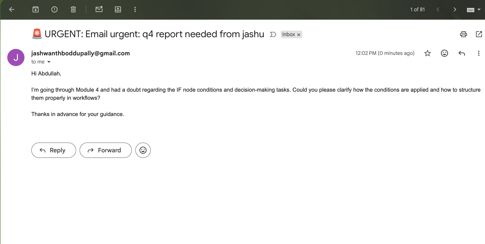
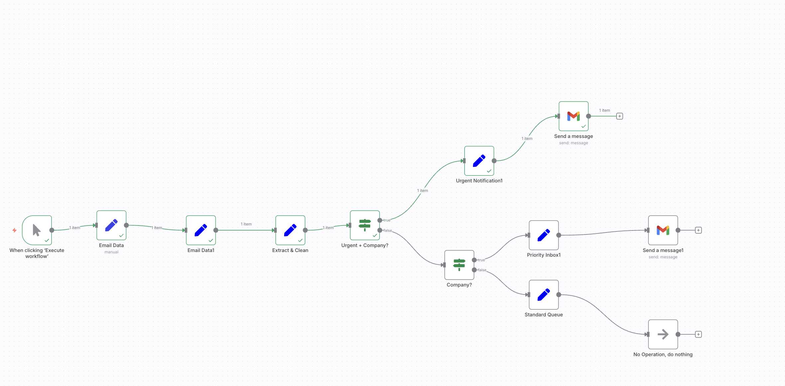

# 📧 IF Node Logic with Urgent Keyword — Demo Workflow

This demo shows how to classify and act on incoming emails using **IF nodes** for decision-making in n8n.

---

## ⚙️ Workflow Overview
1. **Manual Trigger** → start workflow on demand.
2. **Email Data** → simulate an incoming email with sender, subject, and body.
3. **Email Data1** → pass email values forward safely.
4. **Extract & Clean** → normalize fields (domain, subject lowercase, urgent check, sender name).
5. **Urgent + Company?** → IF node checks if subject contains "urgent" AND sender domain is company domain.
6. **Urgent Notification** → marks urgent, builds alert message.
7. **Company?** → secondary IF, decides if company but not urgent.
8. **Priority Inbox** → mark company non-urgent.
9. **Standard Queue** → mark external emails.
10. **Send Message (Gmail)** → send notification based on category.

---

## 🖼️ Workflow Canvas

---

## 📩 Email Output Example
When the workflow runs, Gmail node sends structured mail like this:

---

## ✅ Decision Paths
- 🚨 **Urgent + Company** → Immediate notification
- ⚠️ **Company only** → Priority inbox
- 📧 **External** → Standard queue (no operation)

---

## 📂 Files Included
- `IF Node Logic with Urgent keyword Demo (1).json` — workflow file importable into n8n
- `IF-Node-Logic-Guide.md` — this guide
- `images/` — screenshots for workflow + email output
