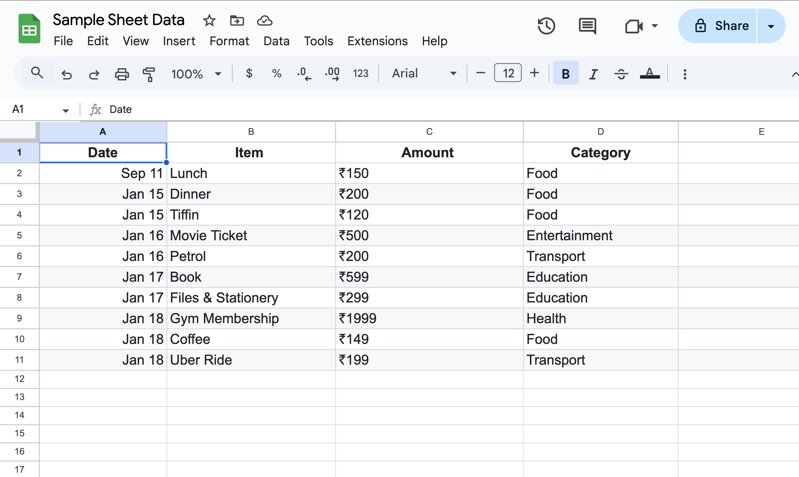
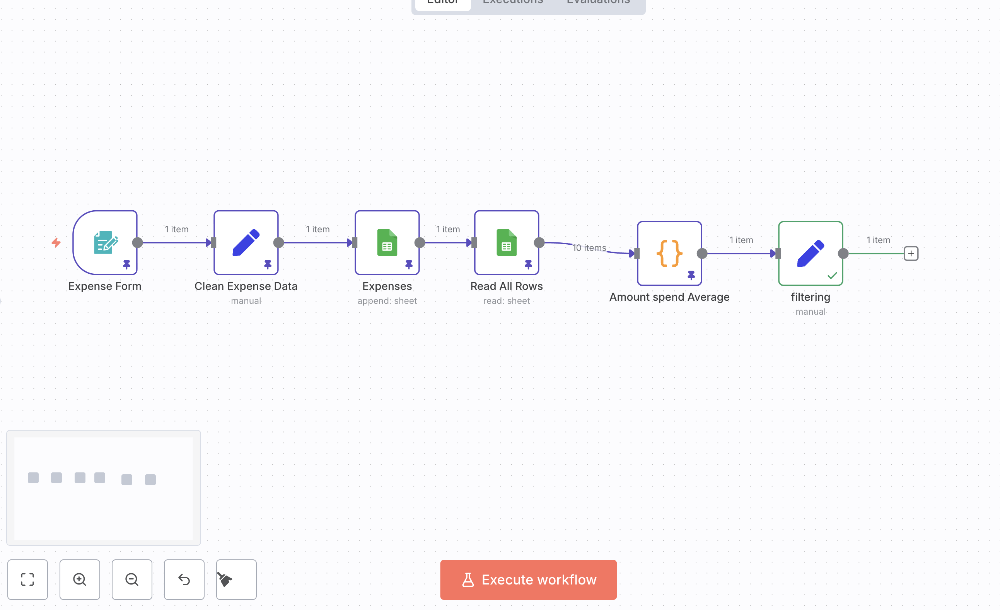
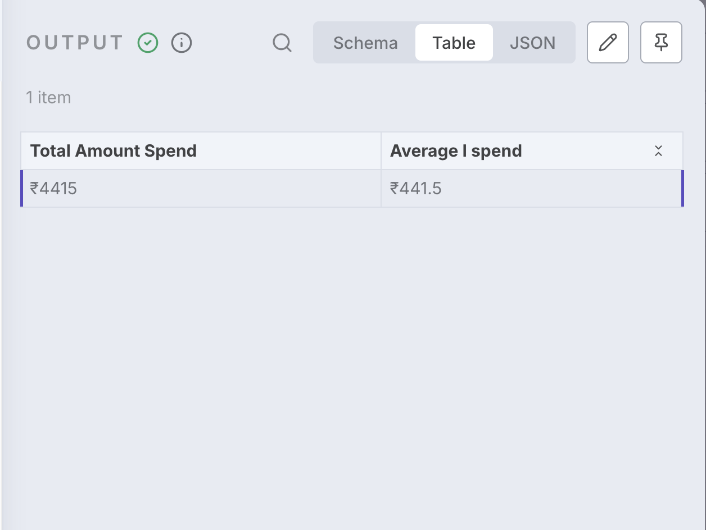

# 📊 Expense Tracker Workflow in n8n

⚠️ **Authentication Note:**  
You must connect your **Google Sheets account** with OAuth2 in n8n before starting these steps.

---

## 🛠 Workflow Steps

### 1 ➝ Expense Form (Trigger)
- Drag & drop **Form Trigger** node.  
- Configure fields:  
  - Date (type: Date)  
  - Item (type: Text)  
  - Amount (type: Number)  
  - Category (type: Dropdown: Food, Entertainment, Education, Transport, Health, Other).  

📸 *Form Node Example:*  


---

### 2 ➝ Clean Expense Data (Set Node)
- Add a **Set** node.  
- Map inputs:  
  - Date → `={{ $json.Date }}`  
  - Item → `={{ $json.Item }}`  
  - Amount → `=₹{{ $json.Amount }}`  
  - Category → `={{ $json.Category }}`  

---

### 3 ➝ Append to Google Sheets
- Add **Google Sheets** node.  
- Operation → `Append`  
- Select your sheet (e.g., *Sheet1*).  
- Map columns: Date, Item, Amount, Category.  

---

### 4 ➝ Read All Rows
- Add another **Google Sheets** node.  
- Operation → `Get Row(s)`  
- No filters → returns all rows.  

📸 *Sample Google Sheet:*  


---

### 5 ➝ Amount Spend Average (Code Node)
- Add a **Code** node.  
- Paste script:  

```js
let totalSpent = 0;
let rowCount = 0;

for (const row of items) {
  let rawAmount = row.json["Amount"] || row.json["Amount\t"] || "0";
  const amount = parseFloat(String(rawAmount).replace(/[^0-9.]/g, ""));
  
  if (!isNaN(amount)) {
    totalSpent += amount;
    rowCount++;
  }
}

return [{
  json: {
    totalSpent,
    rowCount,
    averageSpend: totalSpent / (rowCount || 1)
  }
}];
```

---

### 6 ➝ Filtering / Final Output (Set Node)
- Add **Set** node → rename to *Filtering*.  
- Configure fields:  
  - **Total Amount Spend** → `=₹{{$json.totalSpent}}`  
  - **Average I spend** → `=₹{{$json.averageSpend}}`  

📸 *Workflow Canvas:*  


📸 *Output Example:*  


---

## ✅ Final Workflow Flow
`Expense Form ➝ Clean Expense Data ➝ Append to Sheets ➝ Read All Rows ➝ Code ➝ Filtering`

---

## 🎯 What You’ll Learn
- Append form responses into Google Sheets.  
- Read all rows dynamically.  
- Use code node to calculate **total** + **average spending**.  
- Format clean output for reporting.  

---
