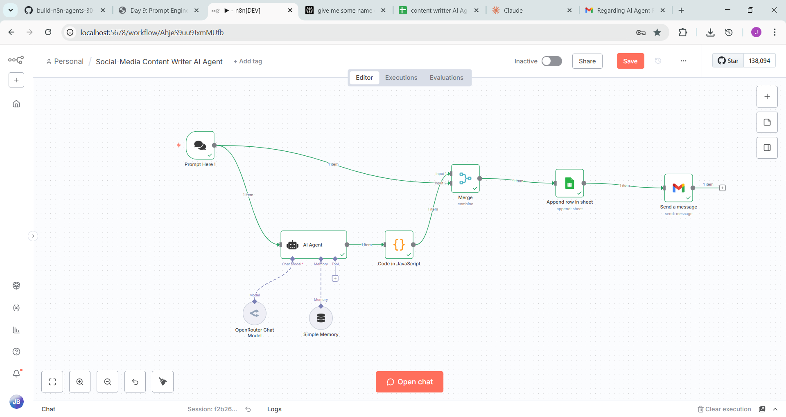
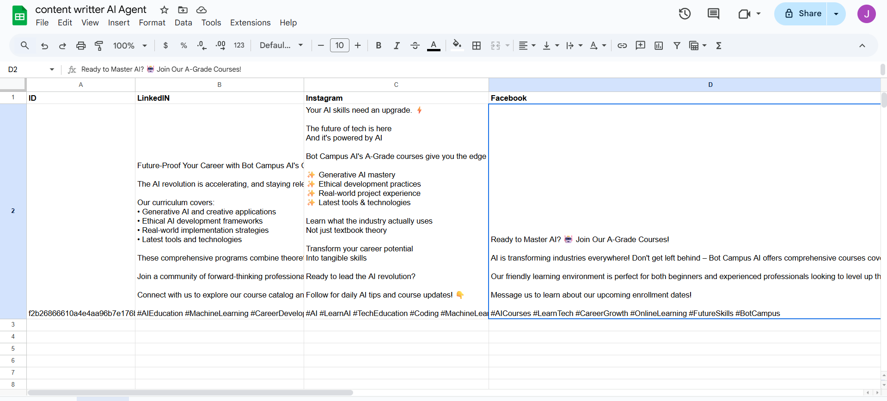
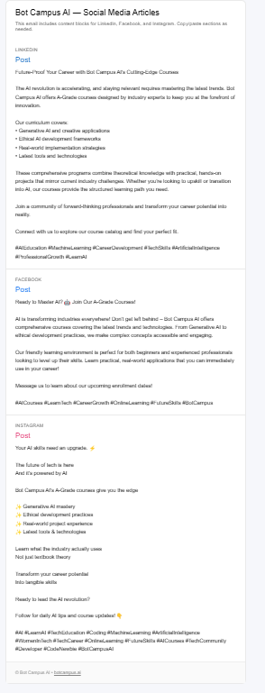

# Social‑Media Content Writer AI Agent (n8n) — **OpenRouter Chat Model**
> Generates LinkedIn, Facebook, and Instagram articles from a single prompt, logs them to Google Sheets, and emails an HTML bundle.


---

## ⚠️ Authentication (do this first)
- **OpenRouter API Key** → Create at openrouter.ai → add credential in n8n (**OpenRouter**). Select a route (e.g., `deepseek/deepseek-chat-v3.1:free` or any `mistralai/...` model).
- **Google Sheets (OAuth2)** → Enable Sheets & Drive → connect **Google Sheets** node.
- **Gmail (OAuth2)** → Enable Gmail API → connect **Gmail: Send a message** node.

---

## Power Pattern: **Input → Process → Output**
**Prompt Here! (Chat Trigger)** ➝ **AI Agent** *(System Prompt)* + **OpenRouter Chat Model** + **Simple Memory** ➝ **Code in JavaScript** *(split to LinkedIn/Facebook/Instagram)* ➝ **Merge (combineAll)** ➝ **Google Sheets: Append** ➝ **Gmail: Send a message (HTML)**.

---
## Figure — Workflow canvas




---

## Node‑by‑Node (drag ➝ drop ➝ configure)

### 1) Prompt Here! (Chat Trigger)
- Message field to type your **Prompt**.
- This flows to **AI Agent** and also directly to **Merge** (keeps metadata like `sessionId`).

### 2) OpenRouter Chat Model
- **Model (route):** `deepseek/deepseek-chat-v3.1:free` *(switch to your preferred Mistral/DeepSeek route as needed)*
- **Credential:** your OpenRouter API key.

### 3) AI Agent — System Prompt
Paste the full system prompt that produces structured JSON for three platforms (LinkedIn, Facebook, Instagram). This is the same prompt from your JSON export.

### 4) Simple Memory
- **Type:** Buffer Window, **Context Window Length:** 15 (keeps recent chat turns).

### 5) Code in JavaScript — **Split AI output**
Paste this exact code to extract the three platform texts:

```javascript
/** n8n Function node: split AI output into LinkedIn/Facebook/Instagram */
function getRaw(llm){if(!llm)return'';if(typeof llm==='string')return llm;if(llm.output)return String(llm.output);if(llm.text)return String(llm.text);if(llm.data)return String(llm.data);if(Array.isArray(llm.choices)){const c0=llm.choices[0];if(c0?.message?.content)return String(c0.message.content);if(c0?.text)return String(c0.text)}return''}
function stripCodeFences(s){const t=String(s).trim();if(t.startsWith('```')){let x=t.replace(/^```[\w-]*\s*/,'');if(x.endsWith('```'))x=x.slice(0,-3);return x.trim()}return t}
function tryParseJson(s){try{return JSON.parse(s)}catch(_){const f=s.indexOf('{'),l=s.lastIndexOf('}');if(f!==-1&&l!==-1&&l>f){const cut=s.slice(f,l+1);try{return JSON.parse(cut)}catch{}}}return null}
function pickId(j){return j.ID??j.Id??j.id??j.Id_??''}
function normTags(h){if(!h)return'';return Array.isArray(h)?h.join(' '):String(h)}
function composeFromPost(p){if(!p)return'';const title=p.title?`${p.title}\n\n`:'';const body=p.body?`${p.body}`:'';const tags=normTags(p.hashtags);const cta=p.cta?`\n\n${p.cta}`:'';const link=p.link?`\n${p.link}`:'';const hashtags=tags?`\n\n${tags}`:'';return `${title}${body}${cta}${link}${hashtags}`.trim()}
function fromJson(obj){const out={LinkedIn:'',Facebook:'',Instagram:''};const posts=Array.isArray(obj?.posts)?obj.posts:[];const rows=Array.isArray(obj?.rows)?obj.rows:[];if(posts.length){const m={};for(const p of posts){const n=String(p.platform||'').toLowerCase();m[n]=composeFromPost(p)}out.LinkedIn=m.linkedin||'';out.Facebook=m.facebook||'';out.Instagram=m.instagram||''}
if((!out.LinkedIn||!out.Facebook||!out.Instagram)&&rows.length){const m={};for(const r of rows){const n=String(r.platform||'').toLowerCase();const tags=r.hashtags_joined||normTags(r.hashtags);const body=r.body||'';const title=r.title?`${r.title}\n\n`:'';const cta=r.cta?`\n\n${r.cta}`:'';const link=r.link?`\n${r.link}`:'';const text=`${title}${body}${cta}${link}${tags?`\n\n${tags}`:''}`.trim();m[n]=text}out.LinkedIn||=m.linkedin||'';out.Facebook||=m.facebook||'';out.Instagram||=m.instagram||''}return out}
function fromHeadings(raw){const out={LinkedIn:'',Facebook:'',Instagram:''};const pat=/^\s*(LinkedIn|Facebook|Instagram)\s*:?\s*$/i;const lines=raw.split(/\r?\n/);const sect=[];for(let i=0;i<lines.length;i++){if(pat.test(lines[i])){const name=lines[i].match(pat)[1];sect.push({name,start:i})}}sect.push({name:'__END__',start:lines.length});for(let i=0;i<sect.length-1;i++){const name=sect[i].name;const start=sect[i].start+1;const end=sect[i+1].start;const text=lines.slice(start,end).join('\n').trim();if(/^linkedin$/i.test(name))out.LinkedIn=text;if(/^facebook$/i.test(name))out.Facebook=text;if(/^instagram$/i.test(name))out.Instagram=text}return out}
const out=[];for(const item of items){const j=item.json||{};const ID=pickId(j);let raw=getRaw(j);raw=stripCodeFences(raw);let obj=tryParseJson(raw);let L='',F='',I='';if(obj){const s=fromJson(obj);L=s.LinkedIn;F=s.Facebook;I=s.Instagram}if(!L&&!F&&!I&&raw){const s=fromHeadings(raw);L=s.LinkedIn;F=s.Facebook;I=s.Instagram}out.push({json:{ID,LinkedIn:L||'',Facebook:F||'',Instagram:I||''}})}return out;
```

### 6) Merge (combineAll)
- **Mode:** Combine → **Combine All** (joins the Chat Trigger metadata with split output).

### 7) Google Sheets — Append
- **Document:** your Sheet URL (gid=0)
- **Sheet Name:** `Sheet1`
- **Columns (Define Below):**
  - `ID` → `={{ $('Prompt Here !').item.json.sessionId }}`
  - `LinkedIN` → `={{ $json.LinkedIn }}`
  - `Facebook` → `={{ $json.Facebook }}`
  - `Instagram` → `={{ $json.Instagram }}`
---
## sheet pic 


*Figure — Google Sheets rows.*

### 8) Gmail — Send a message (HTML)
- **To:** `jashwanthboddupally@gmail.com, support@botcampus.ai`
- **Subject:** `AGENTIC AI  - CONTENT WRITER For Social media`
- **Email Type:** HTML
- **Message:** Use the HTML template that injects `{{$json.LinkedIN}}`, `{{$json.Facebook}}`, `{{$json.Instagram}}` into three blocks.

---
## output

*Figure — HTML email preview.*

---

## How to Run
1. Set credentials (OpenRouter, Sheets OAuth2, Gmail OAuth2).
2. **Activate** the workflow → click **Open chat** on the canvas.
3. Enter a prompt (topic + audience + tone). 
4. Inspect **Code** node output for `LinkedIn/Facebook/Instagram` text.
5. Confirm Google Sheets row append and email delivery.

---

## Troubleshooting
- **Empty platform fields:** Check the AI Agent returns valid JSON (`posts[]` or `rows[]`). The Function node has a plain-text fallback.
- **Sheets not updating:** Ensure the service account has edit access and the sheet/tab names match.
- **Gmail HTML looks plain:** Verify **Email Type** is **HTML**.

---

## Files in this package
- `workflow.json` — exported n8n workflow (OpenRouter + AI Agent + Sheets + Gmail).
- `Guide.md` — this step-by-step mockdown.
- `images/` — screenshots (canvas, email preview, sheet rows).

_Packaged on: 2025-09-16T12:57:28_
